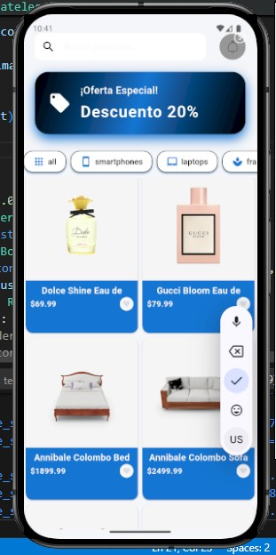
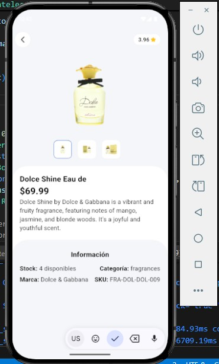

# 🛍️ Flutter - App Productos

**Flutter App Productos** es una aplicación móvil desarrollada en **Flutter** que consume la API pública de [DummyJSON](https://dummyjson.com/). Permite ver una lista de productos con **scroll infinito**, visualizar el detalle de cada producto y gestionar el estado con **Riverpod**.

---

## 🚀 Funcionalidades

✔️ Listado de productos desde API pública [DummyJSON].  
✔️ Scroll infinito para cargar más productos.  
✔️ Pantalla de detalle con descripción e imagen.  
✔️ Gestión de estado con **Riverpod**.  
✔️ Navegación entre pantallas.  
✔️ Diseño **responsivo**.  

---

## 📸 Capturas de pantalla

<details>
	<summary><strong>Lista de productos"</strong></summary>
	
</details>

<details>
	<summary><strong>Tablet (1024x1366)</strong></summary>
	
</details>

**Ejemplo de pantallas:**

- 📱 <b>Lista de productos</b>: Visualiza todos los productos disponibles con scroll infinito.
- 📱 <b>Detalle del producto</b>: Consulta información, imagen y precio de cada producto.

---

## ⚡ Instalación

### 1️ Clona este repositorio

```bash
git clone https://github.com/stivent00/flutter_dummy.git
cd flutter_dummy
```

### 2️⃣ Instala las dependencias

```bash
flutter pub get
```

### 3️⃣ Ejecuta la aplicación

```bash
flutter run
```

### 🛠️ Tecnologías utilizadas

✔️ Flutter 3.29.2  
✔️ Dart 3.7.2  
✔️ Riverpod (gestión de estado)  
✔️ DummyJSON API (fuente de datos)  


### 📄 Licencia  

Este proyecto está bajo la licencia MIT.


### 📫 Contacto

- Email: Jcmamanyomangulo@gmail.com
- LinkedIn: [Juan Angulo](https://www.linkedin.com/in/juan-angulo-77983589)